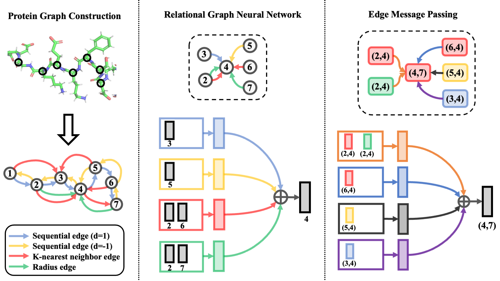

# GearNet: Geometry-Aware Relational Graph Neural Network


This is the official codebase of the paper

**Protein Representation Learning by Geometric Structure Pretraining**, *ICLR'2023*

[[ArXiv](https://arxiv.org/abs/2203.06125)] [[OpenReview](https://openreview.net/forum?id=to3qCB3tOh9)]

[Zuobai Zhang](https://oxer11.github.io/), [Minghao Xu](https://chrisallenming.github.io/), [Arian Jamasb](https://jamasb.io/), [Vijil Chenthamarakshan](https://researcher.watson.ibm.com/researcher/view.php?person=us-ecvijil), [Aurelie Lozano](https://researcher.watson.ibm.com/researcher/view.php?person=us-aclozano), [Payel Das](https://researcher.watson.ibm.com/researcher/view.php?person=us-daspa), [Jian Tang](https://jian-tang.com/)

and the paper

**Enhancing Protein Language Models with Structure-based Encoder and Pre-training**, *ICLR'2023 MLDD Workshop*

[[ArXiv](https://arxiv.org/abs/2303.06275)] [[OpenReview]()]

[Zuobai Zhang](https://oxer11.github.io/), [Minghao Xu](https://chrisallenming.github.io/), [Vijil Chenthamarakshan](https://researcher.watson.ibm.com/researcher/view.php?person=us-ecvijil), [Aurelie Lozano](https://researcher.watson.ibm.com/researcher/view.php?person=us-aclozano), [Payel Das](https://researcher.watson.ibm.com/researcher/view.php?person=us-daspa), [Jian Tang](https://jian-tang.com/)

## News

- [2023/10/17] Please check the latest version of the [ESM-GearNet paper](https://arxiv.org/abs/2303.06275) and [code implementation](https://github.com/DeepGraphLearning/ESM-GearNet)!!

- [2023/03/14] The code for ESM_GearNet has been released with [our latest paper](https://arxiv.org/abs/2303.06275).

- [2023/02/25] The code for GearNet_Edge_IEConv & Fold3D dataset has been released.

- [2023/02/01] Our paper has been accepted by ICLR'2023! We have released the pretrained model weights [here](https://zenodo.org/record/7593637).

- [2022/11/20] We add the scheduler in the `downstream.py` and provide the config file for training GearNet-Edge with single GPU on EC. Now you can reproduce the results in the paper.

## Overview

*GeomEtry-Aware Relational Graph Neural Network (**GearNet**)* is a simple yet effective structure-based protein encoder. 
It encodes spatial information by adding different types of sequential or structural edges and then performs relational message passing on protein residue graphs, which can be further enhanced by an edge message passing mechanism.
Though conceptually simple, GearNet augmented with edge message passing can achieve very strong performance on several benchmarks in a supervised setting.



Five different geometric self-supervised learning methods based on protein structures are further proposed to pretrain the encoder, including **Multivew Contrast**, **Residue Type Prediction**, **Distance Prediction**, **Angle Prediction**, **Dihedral Prediction**.
Through extensively benchmarking these pretraining techniques on diverse
downstream tasks, we set up a solid starting point for pretraining protein structure representations.


This codebase is based on PyTorch and [TorchDrug] ([TorchProtein](https://torchprotein.ai)). 
It supports training and inference with multiple GPUs.
The documentation and implementation of our methods can be found in the [docs](https://torchdrug.ai/docs/) of TorchDrug.
To adapt our model in your setting, you can follow the step-by-step [tutorials](https://torchprotein.ai/tutorials) in TorchProtein.

[TorchDrug]: https://github.com/DeepGraphLearning/torchdrug

## Installation

You may install the dependencies via either conda or pip. Generally, GearNet works
with Python 3.7/3.8 and PyTorch version >= 1.8.0.

### From Conda

```bash
conda install torchdrug pytorch=1.8.0 cudatoolkit=11.1 -c milagraph -c pytorch-lts -c pyg -c conda-forge
conda install easydict pyyaml -c conda-forge
```

### From Pip

```bash
pip install torch==1.8.0+cu111 -f https://download.pytorch.org/whl/lts/1.8/torch_lts.html
pip install torchdrug
pip install easydict pyyaml
```

### Using Docker

First, make sure to setup docker with GPU support ([guide](https://docs.nvidia.com/datacenter/cloud-native/container-toolkit/install-guide.html)).

Next, build docker image

```bash
docker build . -t GearNet
```

Then, after image is built, you can run training commands from within docker with following command

```bash
docker run -it -v /path/to/dataset/directory/on/disk:/root/scratch/ --gpus all GearNet bash
```

## Reproduction

### Training From Scratch

To reproduce the results of GearNet, use the following command. Alternatively, you
may use `--gpus null` to run GearNet on a CPU. All the datasets will be automatically downloaded in the code.
It takes longer time to run the code for the first time due to the preprocessing time of the dataset.

```bash
# Run GearNet on the Enzyme Comission dataset with 1 gpu
python script/downstream.py -c config/downstream/EC/gearnet.yaml --gpus [0]
```

We provide the hyperparameters for each experiment in configuration files.
All the configuration files can be found in `config/*.yaml`.

To run GearNet with multiple GPUs, use the following commands.

```bash
# Run GearNet on the Enzyme Comission dataset with 4 gpus
python -m torch.distributed.launch --nproc_per_node=4 script/downstream.py -c config/downstream/EC/gearnet.yaml --gpus [0,1,2,3]

# Run ESM_GearNet on the Enzyme Comission dataset with 4 gpus
python -m torch.distributed.launch --nproc_per_node=4 script/downstream.py -c config/downstream/EC/ESM_gearnet.yaml --gpus [0,1,2,3]

# Run GearNet_Edge_IEConv on the Fold3D dataset with 4 gpus
# You need to first install the latest version of torchdrug from source. See https://github.com/DeepGraphLearning/torchdrug.
python -m torch.distributed.launch --nproc_per_node=4 script/downstream.py -c config/downstream/Fold3D/gearnet_edge_ieconv.yaml --gpus [0,1,2,3]
```

### Pretraining and Finetuning
By default, we will use the AlphaFold Datase for pretraining.
To pretrain GearNet-Edge with Multiview Contrast, use the following command. 
Similar, all the datasets will be automatically downloaded in the code and preprocessed for the first time you run the code.

```bash
# Pretrain GearNet-Edge with Multiview Contrast
python script/pretrain.py -c config/pretrain/mc_gearnet_edge.yaml --gpus [0]

# Pretrain ESM_GearNet with Multiview Contrast
python script/pretrain.py -c config/pretrain/mc_esm_gearnet.yaml --gpus [0]
```

After pretraining, you can load the model weight from the saved checkpoint via the `--ckpt` argument and then finetune the model on downstream tasks.

```bash
# Finetune GearNet-Edge on the Enzyme Commission dataset
python script/downstream.py -c config/downstream/EC/gearnet_edge.yaml --gpus [0] --ckpt <path_to_your_model>
```

You can find the pretrained model weights [here](https://zenodo.org/record/7593637), including those pretrained with [Multiview Contrast](https://zenodo.org/record/7593637/files/mc_gearnet_edge.pth), [Residue Type Prediction](https://zenodo.org/record/7593637/files/attr_gearnet_edge.pth), [Distance Prediction](https://zenodo.org/record/7593637/files/distance_gearnet_edge.pth), [Angle Prediction](https://zenodo.org/record/7593637/files/angle_gearnet_edge.pth) and [Dihedral Prediction](https://zenodo.org/record/7593637/files/dihedral_gearnet_edge.pth).

## Results
Here are the results of GearNet w/ and w/o pretraining on standard benchmark datasets. **All the results are obtained with 4 A100 GPUs (40GB). Note results may be slightly different if the model is trained with 1 GPU and/or a smaller batch size. For EC and GO, the provided config files are for 4 GPUs with batch size 2 on each one. If you run the model on 1 GPU, you should set the batch size as 8.**
More detailed results are listed in the paper.

<table>
    <tr>
        <th>Method</th>
        <th>EC</th>
        <th>GO-BP</th>
        <th>GO-MF</th>
        <th>GO-CC</th>
    </tr>
    <tr>
        <th>GearNet</th>
        <td>0.730</td>
        <td>0.356</td>
        <td>0.503</td>
        <td>0.414</td>
    </tr>
    <tr>
        <th>GearNet-Edge</th>
        <td>0.810</td>
        <td>0.403</td>
        <td>0.580</td>
        <td>0.450</td>
    </tr>
    <tr>
        <th>Multiview Contrast</th>
        <td>0.874</td>
        <td>0.490</td>
        <td>0.654</td>
        <td>0.488</td>
    </tr>
    <tr>
        <th>Residue Type Prediction</th>
        <td>0.843</td>
        <td>0.430</td>
        <td>0.604</td>
        <td>0.465</td>
    </tr>
    <tr>
        <th>Distance Prediction</th>
        <td>0.839</td>
        <td>0.448</td>
        <td>0.616</td>
        <td>0.464</td>
    </tr>
    <tr>
        <th>Angle Prediction</th>
        <td>0.853</td>
        <td>0.458</td>
        <td>0.625</td>
        <td>0.473</td>
    </tr>
    <tr>
        <th>Dihedral Prediction</th>
        <td>0.859</td>
        <td>0.458</td>
        <td>0.626</td>
        <td>0.465</td>
    </tr>
    <tr>
        <th>ESM_GearNet</th>
        <td>0.883</td>
        <td>0.491</td>
        <td>0.677</td>
        <td>0.501</td>
    </tr>
    <tr>
        <th>ESM_GearNet (Multiview Contrast)</th>
        <td>0.894</td>
        <td>0.516</td>
        <td>0.684</td>
        <td>0.5016</td>
    </tr>
</table>

## Citation
If you find this codebase useful in your research, please cite the following papers.

```bibtex
@inproceedings{zhang2022protein,
  title={Protein representation learning by geometric structure pretraining},
  author={Zhang, Zuobai and Xu, Minghao and Jamasb, Arian and Chenthamarakshan, Vijil and Lozano, Aurelie and Das, Payel and Tang, Jian},
  booktitle={International Conference on Learning Representations},
  year={2023}
}
```

```bibtex
@article{zhang2023enhancing,
  title={A Systematic Study of Joint Representation Learning on Protein Sequences and Structures},
  author={Zhang, Zuobai and Wang, Chuanrui and Xu, Minghao and Chenthamarakshan, Vijil and Lozano, Aurelie and Das, Payel and Tang, Jian},
  journal={arXiv preprint arXiv:2303.06275},
  year={2023}
}
```
